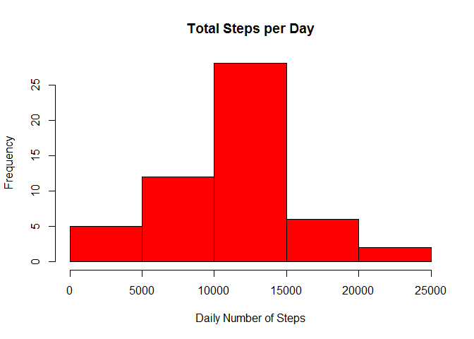
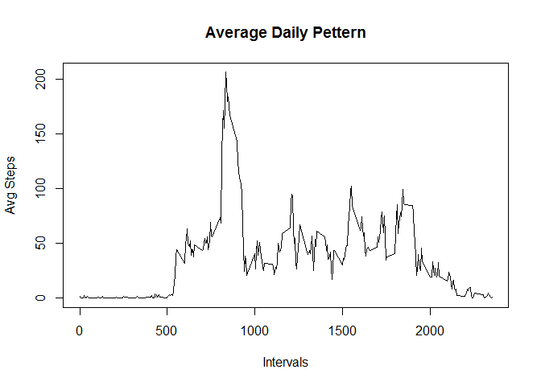
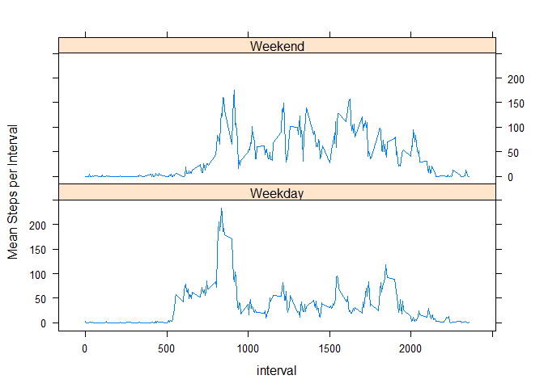

# Reproducible Research: Peer Assessment 1


```r
library(dplyr)
library(lattice)
library(xtable)
```

## Loading and preprocessing the data


```r
activitydf<-read.csv("activity.csv")
```

## What is mean total number of steps taken per day?


```r
totalstepsdf<-filter(activitydf, !is.na(steps)) %>% group_by(date) %>% summarize(total_steps=sum(steps))
mean(totalstepsdf$total_steps)
```

```
## [1] 10766.19
```

```r
median(totalstepsdf$total_steps)
```

```
## [1] 10765
```


```r
hist(totalstepsdf$total_steps, col="red", main="Total Steps per Day", xlab="Daily Number of Steps")
```

 


## What is the average daily activity pattern?


```r
mean_interval_stepsdf<-filter(activitydf, !is.na(steps)) %>% group_by(interval) %>% summarize(avg_steps=mean(steps))


plot(mean_interval_stepsdf$interval, mean_interval_stepsdf$avg_steps, type='l', xlab="Intervals", ylab="Avg Steps", main="Average Daily Pettern")
```

 

## Which 5-minute interval, on average across all the days in the dataset, contains the maximum number of steps?


```r
mean_interval_stepsdf[which.max(mean_interval_stepsdf$avg_steps),]
```

```
## Source: local data frame [1 x 2]
## 
##   interval avg_steps
##      (int)     (dbl)
## 1      835  206.1698
```

##Calculate and report the total number of missing values in the dataset 


```r
length(activitydf[,1])-sum(complete.cases(activitydf))
```

```
## [1] 2304
```

###Devise a strategy for filling in all of the missing values in the dataset.

All the NA values appear in some specific days were we do not have any info.


```r
nadf<-filter(activitydf, is.na(steps))
xt<-(table(nadf$date))
print(xt, type="html")
```

```
## 
## 2012-10-01 2012-10-02 2012-10-03 2012-10-04 2012-10-05 2012-10-06 
##        288          0          0          0          0          0 
## 2012-10-07 2012-10-08 2012-10-09 2012-10-10 2012-10-11 2012-10-12 
##          0        288          0          0          0          0 
## 2012-10-13 2012-10-14 2012-10-15 2012-10-16 2012-10-17 2012-10-18 
##          0          0          0          0          0          0 
## 2012-10-19 2012-10-20 2012-10-21 2012-10-22 2012-10-23 2012-10-24 
##          0          0          0          0          0          0 
## 2012-10-25 2012-10-26 2012-10-27 2012-10-28 2012-10-29 2012-10-30 
##          0          0          0          0          0          0 
## 2012-10-31 2012-11-01 2012-11-02 2012-11-03 2012-11-04 2012-11-05 
##          0        288          0          0        288          0 
## 2012-11-06 2012-11-07 2012-11-08 2012-11-09 2012-11-10 2012-11-11 
##          0          0          0        288        288          0 
## 2012-11-12 2012-11-13 2012-11-14 2012-11-15 2012-11-16 2012-11-17 
##          0          0        288          0          0          0 
## 2012-11-18 2012-11-19 2012-11-20 2012-11-21 2012-11-22 2012-11-23 
##          0          0          0          0          0          0 
## 2012-11-24 2012-11-25 2012-11-26 2012-11-27 2012-11-28 2012-11-29 
##          0          0          0          0          0          0 
## 2012-11-30 
##        288
```

For that reason i will assign for every NA the average number of steps

## Imputing missing values


```r
newdf<-activitydf

newdf[is.na(newdf[,1]),1]<-mean(activitydf$steps, na.rm=TRUE)

totalstepsnewdf<-select(newdf, 1:3) %>% group_by(date) %>% summarize(total_steps=sum(steps))


mean(totalstepsnewdf$total_steps)  
```

```
## [1] 10766.19
```

```r
median(totalstepsnewdf$total_steps)
```

```
## [1] 10766.19
```

The mean is the same but the median changes sligthly

## Are there differences in activity patterns between weekdays and weekends?


```r
cleandf<-filter(activitydf, !is.na(steps))

cleandf$date<-weekdays(as.Date(cleandf$date, format = "%Y-%m-%d"))
cleandf$weekend<-cleandf$date
cleandf[which((cleandf[,2] %in% c("Saturday", "Sunday"))),4]<-"Weekend"

cleandf[which(!(cleandf[,2] %in% c("Saturday", "Sunday"))),4]<-"Weekday"

mean_interval_stepsdfv2<-select(cleandf, 1:4) %>% group_by(interval, weekend) %>% summarize(avg_steps=mean(steps))

mean_interval_stepsdfv2<-transform(mean_interval_stepsdfv2, weekend<-factor(weekend))
xyplot(avg_steps~interval | weekend, 
data=mean_interval_stepsdfv2, type='l', layout=c(1,2), ylab="Mean Steps per Interval")
```

 

From the plot we can see that there is differences in activity patterns between weekdays and weekends


